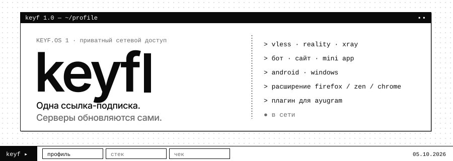
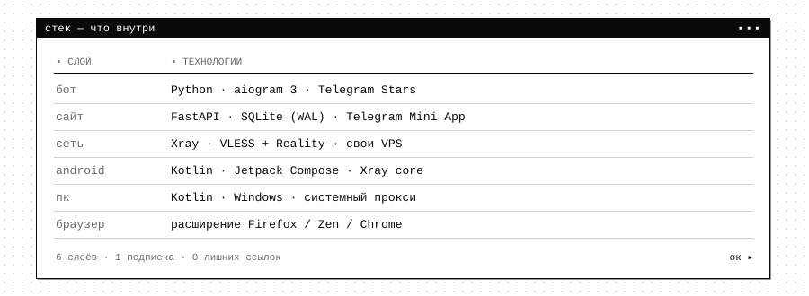
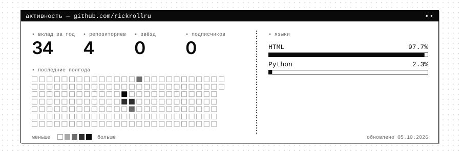
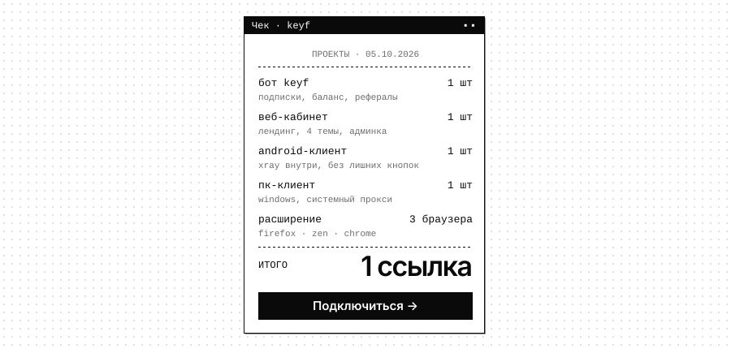

<p align="center">
  <a href="https://pnvkeyftg.lol"></a>
</p>

<p align="center">
  <a href="https://pnvkeyftg.lol"></a>
  <a href="https://t.me/Subvpnkeyf_bot"></a>
  
</p>

```text
▪ keyf 1.0 ─────────────────────────────────────────────────────────▪▪
  делаю keyf: бот, сайт, клиенты под android и windows,
  расширение для браузеров. одна ссылка-подписка вместо пачки ключей.
```

<p align="center">
  
</p>

<p align="center">
  
</p>

<p align="center">
  <a href="https://pnvkeyftg.lol"></a>
</p>

<p align="center"><sub><code>© 2026 keyf · ▪▪</code></sub></p>
